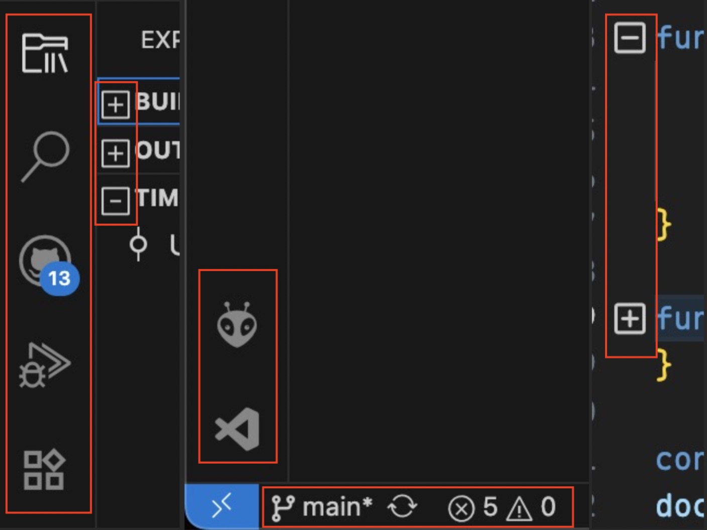

# VSCode product icon theme (_El-Minimalist Icons_)

This is simple theme to change the product icon of vscode. It usage proposed api to work.

# How to Install?

- First install it from [Marketplace](https://marketplace.visualstudio.com/items?itemName=ElAnandKumar.el-vsc-product-icon-theme).
- Launch the VSCode.
- Once VSCode is open, use the command panel (Ctrl/Cmd + shift + p) and search for `Preferences: Product Icon Theme`.
- Select `El-Minimalist Icons` as the icon theme.

# Noticeable Changes?

- Activity bar icons:
  - Explorer
  - Search
  - Git
  - Debug
  - Extensions
  - Account
  - Settings
  - Expand/collapse
- Status Bar
  - Code collapse/expand
  - Folder expand/collapse icon
  - cloud upload/download
  - git branch
  - error
  - warning
  - info
  - bell

## How it looks?

#### Activity Bar
Changes are highlighted with red boxes.

