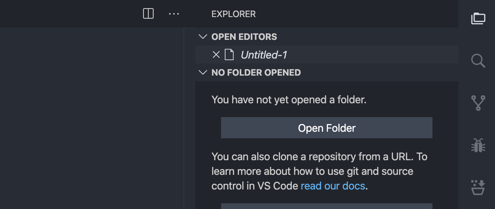

# Product Icon Theme Samples

[Product icons themes](https://code.visualstudio.com/api/extension-guides/product-icon-theme) allow theme authors to customize the icons used in VS Code's built-in views: all icons except file icons (covered by file icon themes) and icons contributed by extensions.

This sample provides a product icon theme with icons used in VS Code 1.0.

## Demo

VSCode Product Icon

