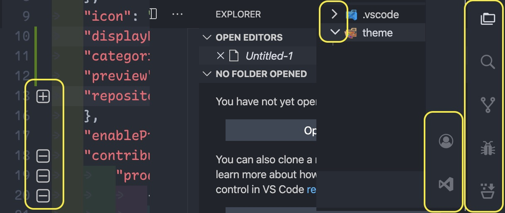

# VSCode product icon theme

This is simple them to change the product icon of vscode. It usage proposed api to work.

# How to use it?

- First install it from market place.
- Then launch the VSCode with `--enable-proposed-api=elanandkumar.el-vsc-product-icon-theme` command.
- Once VSCode is open, use the command panel to change the product icon. Search for `Product Icon Theme` in the command pallet. Highlight it and press enter. Then select `El-VSCode 1.0 Icons` as the icon theme.

> Please note that due to limitations, it only works if we start with `--enable-proposed-api` flag as mentioned above.

The above step is required to enable it else it won't work. Further update to vscode and this extension may solve this.

# What all changes?

- Activity bar icons:
  - Explorer
  - Search
  - Git
  - Debug
  - Extensions
  - Account
  - Settings
- Code collapse/expand
- Folder expand/collapse icon

## How it looks?

Changes are highlighted with yellow boxes.

